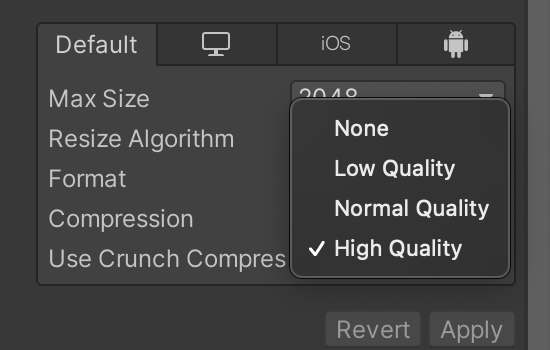
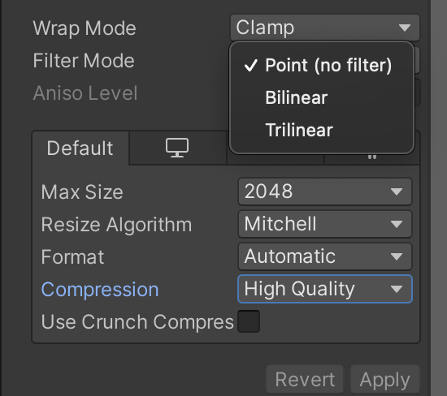
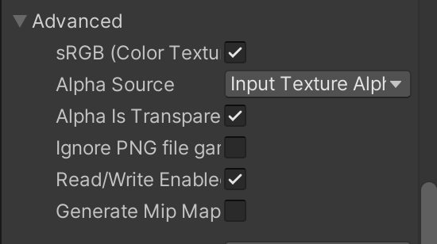

# Using

``` csharp
// Add script to folder
// Add an image to the project [.png]
// Change image values in properties
```






``` csharp
// In the field "map" add an image with changed properties
// In the "level" field, an object from the hierarchy of the scene where the map will be
// In the elements, set up the color and the object
```